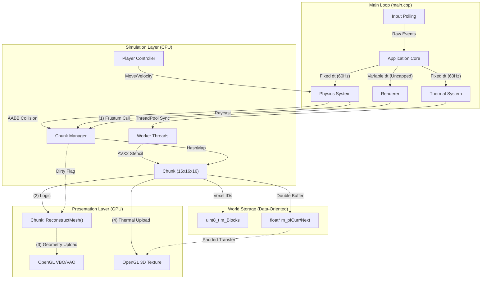

# System Architecture & Design Decisions

This document outlines the high-level architecture of the Voxel Engine and records significant engineering decisions (ADRs).

## 1. System Overview:

The engine uses a Data-Oriented architecture, strictly separating the Simulation Loop (Physics/Logic) from the Rendering Loop. This ensures deterministic physics regardless of frame rate.

### High-Level Data Flow

### 2. Architecture Decision Records (ADR):

The following log details key technical decisions, their context, and the trade-offs accepted during development.

**ADR-001: Data-Oriented Voxel Storage**

  - Context: A voxel engine processes millions of blocks per frame for mesh generation and physics queries.
  - Decision: We use a Struct-of-Arrays (SoA) layout (flat uint8_t arrays) rather than an Array-of-Objects (Block class instances).
  - Consequences:
      - (+) Cache Coherency: Drastically improves CPU cache hits during iteration.
      - (+) Memory Footprint: Reduces memory usage by avoiding padding/alignment overhead of classes.
      - (-) Complexity: Makes adding complex per-block data (like inventory) harder, requiring a separate sparse map lookup.

**ADR-002: Decoupled Simulation Loop**

  - Context: Physics simulations (gravity, collision) require a stable delta-time (dt) to remain mathematically deterministic. Rendering, however, should run as fast as the GPU allows.
  - Decision: We implemented a Fixed-Timestep Accumulator.
  - Consequences:
      - (+) Stability: Physics remains stable even if framerate drops to 10 FPS.
      - (+) Smoothness: Rendering is uncapped (e.g., 600+ FPS) for fluid camera movement.
      - (-) Interpolation: Requires interpolating render states between physics frames to prevent visual "stutter" (micro-jitter).

**ADR-003: Modern OpenGL (Direct State Access)**

  - Context: Legacy OpenGL relies on a global state machine (glBindBuffer), which is error-prone and adds driver overhead.
  - Decision: We enforce OpenGL 4.5 Core Profile and use Direct State Access (DSA) where possible.
  - Consequences:
      - (+) Safety: We can modify objects (Textures, Buffers) without binding them to the context, reducing state-leaking bugs.
      - (+) Performance: Reduces driver validation overhead.
      - (-) Compatibility: Increases the hardware requirement (GPU must support OpenGL 4.5+).

**ADR-004: Multi-Threaded Thermal Diffusion (SIMD)**

  - Context: Real-time thermal diffusion across millions of voxels requires high-throughput floating-point math.
  - Decision: We utilize a Thread Pool with std::barrier synchronization and AVX2 SIMD intrinsics for 7-point stencil calculations.
  - Consequences:
    - (+) Performance: Worker threads process chunk subsets in parallel without mutex contention.
    - (+) Vectorization: AVX2 allows processing 8 voxels simultaneously per instruction.
    - (-) Memory Alignment: Requires strict 64-byte alignment for aligned memory loads/stores to avoid CPU traps.

**ADR-005: Header-Only C++20 Architecture**

  - Context: Rapid prototyping requires fast iteration without managing complex linker dependencies.
  - Decision: The engine is primarily Header-Only with inline definitions.
  - Consequences:
      - (+) Build Speed: Simplifies the build system (no separate compilation units to link).
      - (+) Optimization: Allows the compiler to aggressively inline functions across the entire codebase.
      - (-) Scalability: Increases compilation time for full rebuilds as the project grows larger.