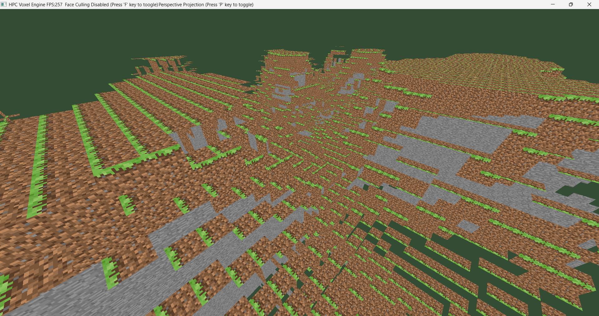

# HPC Voxel Engine


A high-performance CPU/GPU voxel engine built from scratch in C++20.
Designed to explore computational geometry, hardware-accelerated rendering, and low-level memory management.



## 🚀 Overview

This project is a technical playground for implementing high-performance graphics concepts without relying on heavy game engines. The core focus is on:
* **Data-Oriented Design** for cache efficiency.
* **Custom Math Library** (SIMD-ready vectors and matrices).
* **Modern OpenGL (4.6)** utilizing Compute Shaders for voxel generation.
* **Zero-dependency architecture** (managing memory and resources manually).

## 🛠️ Tech Stack

* **Language:** C++20 (Concepts, Modules, constexpr math)
* **Graphics API:** OpenGL 4.6 (Core Profile)
* **Build System:** CMake 3.23+
* **Windowing:** GLFW (fetched via CMake)
* **Loader:** GLAD
* **Assets/Math:** stb_image (Textures), FastNoiseLite (Procedural Generation)

## ✨ Key Features (Current & Planned)

### ✅ Completed
- [x] **Core Math Library:** Custom `Vec3` implementation with `constexpr` optimization.
- [x] **Render Context:** Robust GLFW window handling and input polling.
- [x] **Interactive Camera:** WASD movement, Mouse Look, and Zoom.
- [x] **Chunk System:** 16x16x16 Voxel Mesh Generation.
- [x] **Procedural Terrain:** Infinite terrain generation using `FastNoiseLite` (OpenSimplex2).
- [x] **Biome System:** Height-based block assignment (Grass, Dirt, Stone).
- [x] **Texture Atlas:** Efficient single-texture rendering with dynamic UV mapping (256x256 grid).
- [x] **Optimization:** Greedy Face Culling (occlusion culling) for rendering efficiency.
- [x] **Build System:** Self-contained CMake setup with automated dependency management.

### 🚧 In Progress (Day 04 Roadmap)
- [ ] **Player Physics:** AABB Collision detection and Gravity.
- [ ] **Ray Casting:** DDA Algorithm for block selection.
- [ ] **Interaction:** Block breaking and placing mechanics.

### 📅 Planned
- [ ] **Infinite World:** Dynamic chunk paging and multithreaded generation.
- [ ] **Lighting Engine:** Ambient Occlusion (AO) and Day/Night cycle.
- [ ] **Water Simulation:** Transparent rendering pass.

## 📦 Build Instructions

### Prerequisites
* **C++ Compiler:** MSVC (Visual Studio 2022) or GCC 11+
* **CMake:** Version 3.23 or higher
* **GPU Drivers:** Must support OpenGL 4.6

### Steps
1.  **Clone the repository:**
    ```bash
    git clone [https://github.com/KabilanKumar36/cpp-hpc-voxel-engine.git](https://github.com/KabilanKumar36/cpp-hpc-voxel-engine.git)
    cd cpp-hpc-voxel-engine
    ```

2.  **Generate Project Files:**
    ```bash
    mkdir build
    cd build
    cmake ..
    ```

3.  **Build:**
    Open the generated solution in Visual Studio or run:
    ```bash
    cmake --build . --config Release
    ```

4.  **Run:**
    ```bash
    ./bin/Release/VoxelEngine.exe
    ```

## 📂 Project Structure

```text
src/
├── core/       # Math (Vec3, Ray, FastNoiseLite), Memory, and Base Types
├── renderer/   # OpenGL wrappers (Shader, Buffer, Texture, VAO)
├── world/      # Voxel Data (Chunk, Mesh Generation, Biome Logic)
└── app/        # Window management and Main Loop
external/       # Vendored dependencies (GLAD)
assets/         # Shaders and Textures (Texture Atlas)
📜 License
Distributed under the MIT License. See LICENSE for more information.
