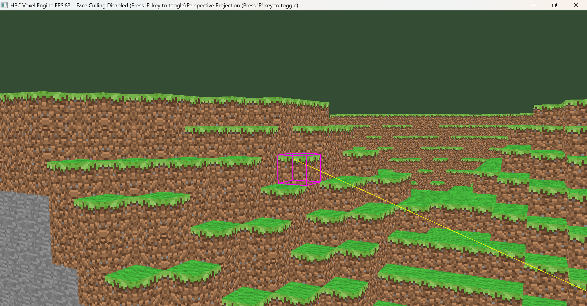
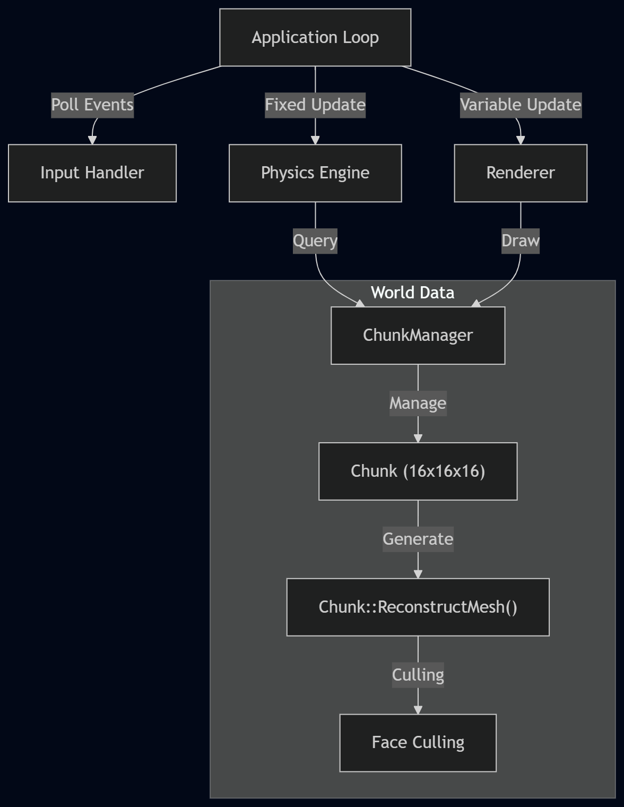

# HPC Voxel Engine


> **🚀 v1.0 Tech Demo Available!**
> [**Download Windows Demo (Zip)**](https://github.com/kabilankumar36/cpp-hpc-voxel-engine/releases/latest) - *Requires NVIDIA GPU*

A high-performance CPU/GPU voxel engine built from scratch in C++20.
Designed as a foundational framework for Computational Engineering (CAE) simulations, focusing on cache coherency, hardware-accelerated rendering, custom memory allocators, and low-level memory management.



## 🚀 Overview

This project is a technical playground for implementing high-performance graphics concepts without relying on commercial game engines. The engine is architected to support Finite Element Analysis (FEA) and Physics Simulations in later stages.

**Core Engineering Pillars:**

* **Data-Oriented Design:** Struct-of-Arrays (SoA) layout for voxel data to maximize CPU cache hits.
* **Custom Math Library:** SIMD-ready vectors and matrices implementation.
* **Systems Hardening:** Zero-warning codebase enforced by CI/CD (`/WX` (MSVC) and `-Werror` GCC/Clang).
* **Modern OpenGL (4.6):** Direct State Access (DSA) and optimized buffer streaming for voxel generation.
* **Memory Management:** Leveraging C++20 features and RAII/Move Semantics for deterministic resource lifecycles.
* **Zero-Dependency:** Managing memory, windowing context, and resources manually without heavy frameworks.

## 🛠️ Tech Stack

| Component | Technology | Reasoning |
| :--- | :--- | :--- |
| **Language** | C++20 | Concepts, Modules, `constexpr` math optimizations. |
| **Graphics** | OpenGL 4.6 | Core Profile for compute-shader readiness and DSA. |
| **Build System** | CMake 3.23+ | `FetchContent` for dependency-free setup. |
| **Windowing** | GLFW 3.4 | Robust cross-platform context management. |
| **Loader** | GLAD | Dynamic loader for OpenGL function pointers. |
| **Math** | Custom SIMD | Hand-rolled Vector/Matrix library for solver integration. |
| **Procedural** | FastNoiseLite | OpenSimplex2 noise for infinite terrain generation. |
| **Asset** | stb_image | Lightweight image loading for texture atlases. |
| **Testing** | GoogleTest | Automated verification for Physics and Math logic. |

## 📐 System Architecture

The engine follows a strict separation of concerns between the Simulation Loop (Fixed Timestep) and Rendering Loop (Variable Timestep).



## ✨ Key Features (Current & Planned)

### ✅ Completed
- [x] **High-Performance Rendering:**
    - **Frustum Culling:** CPU-side optimization checking Chunk AABBs against camera planes.
    - **Hidden Face Removal:** Internal and Inter-Chunk occlusion culling (reducing vertex count by ~85%).
    - **Distance Fog:** Exponential fog shader to mask world borders and chunk loading.
    - **Smart Texturing:** Dynamic UV mapping with bitwise face-id logic.

- [x] **Core Architecture:**
    - **Region-Based Persistence:** Custom `.mcr` file system that saves modified chunks to disk (Run-Length Encoded).
    - **Worker Thread Pool:** Asynchronous job system for non-blocking chunk generation and mesh building.
    - **ImGui Debugger:** Real-time performance profiling and variable tuning (toggle via `~` key).
    - **Zero-Warning Policy:** CI pipeline enforcing `clang-format` and strict linting (`/WX`, `-Werror`).

- [x] **Physics & Interaction:**
    - **AABB Collision:** Precise Axis-Aligned Bounding Box detection against voxel terrain.
    - **Kinematic Character Controller:** "Collide & Slide" resolution for smooth movement.
    - **Infinite Streaming:** Dynamic loading/unloading of chunks based on player position.
    - **Fly Mode:** Creative-mode flight with noclip and variable speed control.
    - **Ray Casting:** DDA (Digital Differential Analyzer) algorithm for O(1) block picking.

- [x] **Engine Core:**
    - **Custom Math Library:** `Vec3` / `Mat4` implementation with `constexpr` and SIMD-ready optimization.
    - **Interactive Camera:** Euler-angle based FPS camera with WASD movement, Mouse Look, and Zoom.
    - **Render Context:** Robust GLFW window handling and input polling.
    - **Thread Safety:** Mutex-guarded chunk management for safe multi-threaded loading.

- [x] **Procedural Generation:**
    - **Infinite Terrain:** Continuous world generation using `FastNoiseLite`.
    - **Biome System:** Height-based block assignment (Bedrock, Stone, Dirt, Grass).

- [x] **Build & CI:**
    - **Zero-Dependency Setup:** Self-contained CMake build using `FetchContent`.
    - **Automated Testing:** GoogleTest suite for Math/Physics verification running on GitHub Actions.
    - **Automated Docs:** Doxygen & Graphviz integration for API documentation.

### 🚧 Backlog (Next Sprint)
- [ ] **Greedy Meshing:** Merging adjacent faces of the same type to drastically reduce vertex count and GPU memory usage.
- [ ] **Fluid Simulation:** Finite Element Analysis (FEA) based fluid flow using cellular automata.

### 🧊 Roadmap (Icebox)
- [ ] **Morton Encoding (Z-Order Curve):** Reordering chunk memory layout to improve spatial cache locality. [Image of Z-Order Curve Morton Code]
- [ ] **Directional Shadow Mapping:** Cascaded Shadow Maps (CSM) for dynamic sun lighting.
- [ ] **Compute Shaders:** Moving voxel generation from the CPU Thread Pool to the GPU.

## 📦 Build Instructions

### Prerequisites
* **C++ Compiler:** MSVC (Visual Studio 2022) or GCC 11+
* **CMake:** Version 3.23 or higher
* **GPU Drivers:** Must support OpenGL 4.6

### Steps
1.  **Clone the repository:**
    ```bash
    git clone [https://github.com/KabilanKumar36/cpp-hpc-voxel-engine.git](https://github.com/KabilanKumar36/cpp-hpc-voxel-engine.git)
    cd cpp-hpc-voxel-engine
    ```

2.  **Generate Project Files:**
    ```bash
    mkdir build
    cd build
    cmake ..
    ```

3.  **Build:**
    Open the generated solution in Visual Studio or run:
    ```bash
    cmake --build . --config Release
    ```

4.  **Run:**
    ```bash
    ./bin/Release/VoxelEngine.exe
    ```

## 🧪 Testing

The project uses **GoogleTest** for unit testing. The build system automatically fetches the dependency and compiles the test suite.

### Running Tests
1.  **Configure & Build:**
    ```bash
    cmake -B build
    cmake --build build
    ```
2.  **Run the Test Executable:**
    ```bash
    ./build/bin/unit_tests.exe
    ```

**Coverage:**
* **Physics Logic:** AABB intersection and construction assertions.
* **OpenGL Environment:** Automated invisible window creation for context-dependent tests.
* **Chunk Logic:** Verification of mesh generation and buffer sizing.

## 📂 Project Structure

```text
assets/             # Graphics resources (Shaders, Texture Atlas)
docs/               # Documentation
external/           # Heavy dependencies managed via CMake FetchContent (GLFW, GLAD)
src/
├── app/            # Input Manager and Input Handler
├── core/           # Math (Vec3, Matrix), Camera, Threading, Memory Management, and Base Types
├── physics/        # Physics Engine (AABB, PhysicsSystem, RigidBody)
├── renderer/       # OpenGL 4.6 Wrappers (Shader, Buffer, Texture, VAO and World & Primitive Renderers)
├── world/          # Voxel Logic (Chunk, Mesh Generation, Biome System and Player)
├── vendor/         # Third-party single-header libraries (stb_image, etc.)
└── main.cpp        # Entry point and Application Loop
tests/              # GoogleTest suite (Physics, Math, and Render verification)
vendor/             # Lighter Third-party dependencies (stb_image, etc.)
```

## 📜 License
Distributed under the MIT License. See LICENSE for more information.
